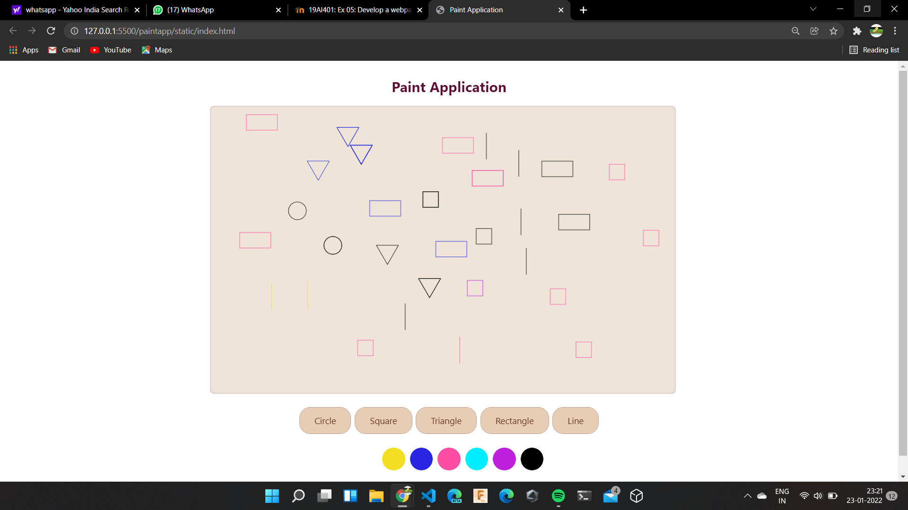

# Web Page for Paint Application

## AIM:

To design a static website for Paint Application using HTML5 canvas.

## DESIGN STEPS:

### Step 1:

Requirement collection.

### Step 2:

Creating the layout using HTML,CSS and canvas.

### Step 3:

Write javascript to capture move events.

### Step 4:

Perform the drawing operation based on the user input.

### Step 5:

Validate the layout in various browsers.

### Step 6:

Validate the HTML code.

### Step 6:

Publish the website in the given URL.

## PROGRAM :

<!DOCTYPE html>
<html lang="en">
<head>
    <meta charset="UTF-8">
    <meta http-equiv="X-UA-Compatible" content="IE=edge">
    <meta name="viewport" content="width=device-width, initial-scale=1.0">
    <title>Paint Application</title>
    <link rel="stylesheet" href="./css/style.css" />
    

</head>
<body>
    <h1>Paint Application</h1>
    

        

            <canvas id="myCanvas" width="1050" height="650"></canvas>
        

         
        

            <input type="button" class="shapesel" id="armyst" value="Circle">
            <input type="button" class="shapesel" id="armyst1" value="Square">
            <input type="button" class="shapesel" id="armyst2" value="Triangle">
            <input type="button" class="shapesel" id="armyst3" value="Rectangle">
            <input type="button" class="shapesel" id="armyst4" value="Line">
        

         
        

            <button onclick="change_color(this)" id="cypher" style="background: white;"></button>
            <button onclick="change_color(this)" id="cypher" style="background: rgb(49, 231, 255);"></button>
            <button onclick="change_color(this)" id="cypher" style="background: rgb(46, 112, 255);"></button>
            <button onclick="change_color(this)" id="cypher" style="background: rgb(213, 76, 255);"></button>
            <button onclick="change_color(this)" id="cypher" style="background: rgb(153, 0, 255);"></button>
            <button onclick="change_color(this)" id="cypher" style="background: rgb(54, 0, 124);"></button>
            <button onclick="change_color(this)" id="cypher" style="background: rgb(0, 0, 0);"></button>
        

    

     
    

    
Developed by Aashima Nazreen S

    

    
    
</body>
</html>
CSS CODE:
*{
   box-sizing: border-box; 
   font-family: 'Lucida Sans', 'Lucida Sans Regular', 'Lucida Grande', 'Lucida Sans Unicode', Geneva, Verdana, sans-serif;
}

body{
    background-image: url("/static/img/bgimg5.png");
    background-size: cover;
}

h1{
    color: rgb(52, 12, 90);
    text-align: center;
    padding-top: 15px;
}

.container{
    width: 1080px;
    margin-left: auto;
    margin-right: auto;
}

canvas{
    background-color: rgb(238, 216, 236);
    box-shadow: inset 0 0 5px #e5b9ee;
    backdrop-filter: blur(15px);
    border-radius: 10px;
    border: 1px solid #ffffff;
}

.shapesel{
    background-color: #cfb3f0;
    border: 2px solid rgb(161, 146, 168);
    border-radius: 25px;
    color: rgb(52, 12, 90);
    padding: 15px 32px;
    text-align: center;
    display: inline-block;
    font-size: 20px;
    margin: 4px 2px;
    cursor: pointer;
}

.buttons1{
    text-align: center;
}

.footer{
    text-align: center;
    color: rgb(52, 12, 90);
    text-align: center;
    font-size: x-large;
}

#cypher{
    border: 2px solid #ffffff;
    border-radius: 30px;
    padding: 20px 20px;
    text-align: center;
    display: inline-block;
    font-size: 16px;
    margin: 4px 2px;
    cursor: pointer;
}
JAVASCRIPT CODE:
myscript.js:
function change_color(element){
    hyyh=element.style.background;
}
function myClickEvent(e){
    var message;
    ctx.beginPath();
    if (shape == 0){
        ctx.arc(e.offsetX, e.offsetY, 20, 0, 2* Math.PI);
        ctx.strokeStyle = hyyh;
        ctx.linewidth = 2;
    } else if (shape == 1){
        ctx.rect(e.offsetX, e.offsetY, 35,35);
        ctx.strokeStyle = hyyh;
        ctx.linewidth = 2;
    } else if (shape == 2){
        ctx.moveTo(e.offsetX, e.offsetY);
        ctx.lineTo(e.offsetX+(t/2), e.offsetY-(t*0.86602));
        ctx.lineTo(e.offsetX-(t/2), e.offsetY-(t*0.86602));
        ctx.lineTo(e.offsetX,e.offsetY);
        ctx.strokeStyle = hyyh;
        ctx.linewidth = 2;
    } else if (shape == 3){
        ctx.rect(e.offsetX, e.offsetY, 70, 35);
        ctx.strokeStyle = hyyh;
        ctx.linewidth = 2;
    } else if (shape == 4){
        ctx.moveTo(e.offsetX, e.offsetY);
        ctx.lineTo(e.offsetX, e.offsetY-(s/2));
        ctx.strokeStyle = hyyh;
        ctx.linewidth = 2;
    }

    ctx.stroke();
}

function circleclicked() {
    shape=0;
}

function squareclicked() {
    shape=1;
}

function triangleclicked() {
    shape=2;
}

function rectclicked() {
    shape=3;
}

function lineclicked() {
    shape=4;
}
mycript1.js:
var c = document.getElementById("myCanvas");
var ctx = c.getContext("2d");
shape=0;
let hyyh="#000000";
let t=50;
let s=120;
ctx.beginPath();
ctx.stroke();
c.addEventListener("click", myClickEvent);
document
.getElementById("armyst")
.addEventListener("click", circleclicked);
document
.getElementById("armyst1")
.addEventListener("click", squareclicked);
document
.getElementById("armyst2")
.addEventListener("click", triangleclicked);
document
.getElementById("armyst3")
.addEventListener("click", rectclicked);
document
.getElementById("armyst4")
.addEventListener("click", lineclicked);
## OUTPUT:

## Result:

Thus a website is designed and validated for paint application using HTML5 canvas
